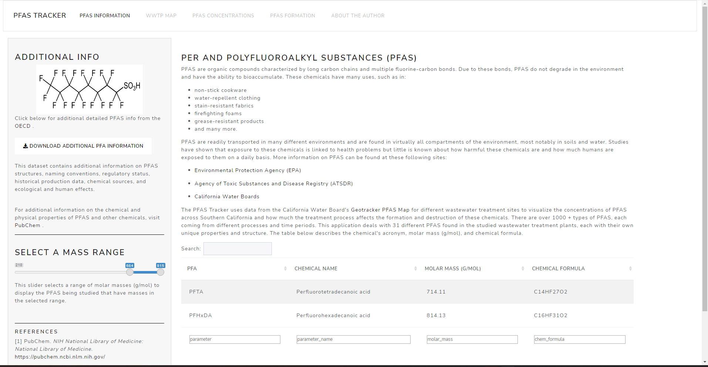
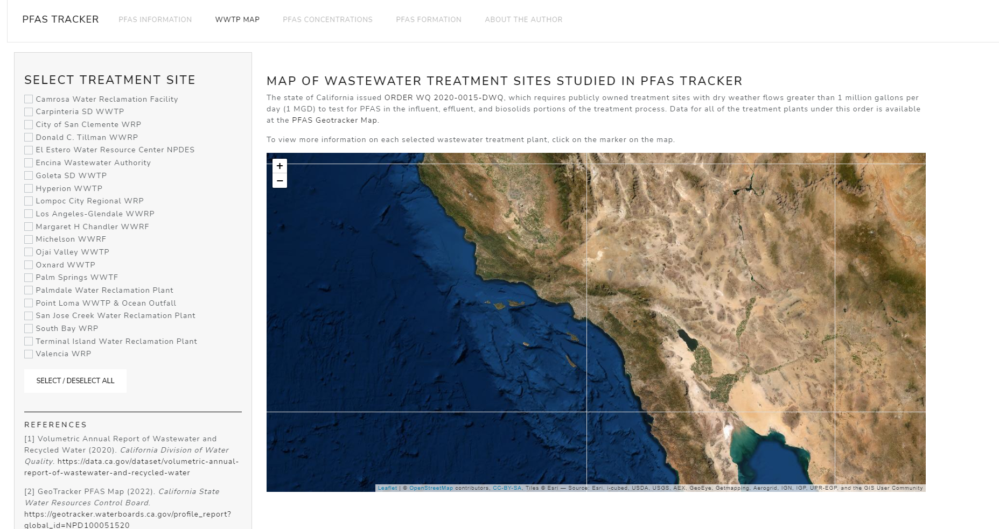
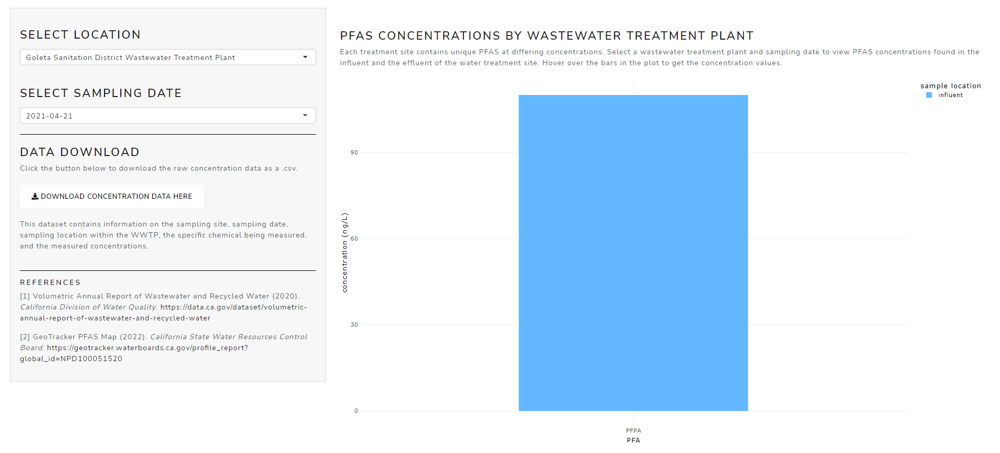

```{r setup, include=FALSE}
knitr::opts_chunk$set(echo = FALSE)
```


### Introduction 

PFAS are organic compounds characterized by long carbon chains and multiple fluorine-carbon bonds. 
Due to these bonds, PFAS do not degrade in the environment and have the ability to bioaccumulate. These chemicals have many uses, such as in:

- non-stick cookware
- water-repellent clothing
- stain-resistant fabrics
- firefighting foams
- grease-resistant products
- and many more. 


PFAS are readily transported in many different environments and are found in virtually all compartments of the environment, most notably in soils and water. Studies have shown that exposure to these chemicals is linked to health problems but little is known about how harmful these chemicals are and how much humans are exposed to them on a daily basis. More information on PFAS can be found at these following sites:

- [Environmental Protection Agency (EPA)](https://www.epa.gov/pfas/pfas-explained)
 
- [Agency of Toxic Substances and Disease Registry (ATSDR)](https://www.atsdr.cdc.gov/pfas/health-effects/overview.html#:~:text=PFAS%20are%20man%2Dmade%20chemicals,grease%2C%20water%2C%20and%20oil)

- [California Water Boards](https://www.waterboards.ca.gov/pfas/background.html)


The PFAS Tracker uses data from the California Water Board's **[Geotracker PFAS Map](https://geotracker.waterboards.ca.gov/map/pfas_map)** for different wastewater treatment sites to visualize the concentrations of PFAS across Southern California and how much the treatment process affects the formation and destruction of these chemicals. There are over 1000 + types of PFAS, each coming from different processes and time periods. This application deals with 31 different PFAS found in the studied wastewater treatment plants, each with their own unique properties and structure. 

### Screencaps of the Application



This is the landing page for the PFAS Tracker.



These are the water treatment sites measured.



This page shows the concentrations of PFAS found in the treatment sites.

### Future

Check out the github repository for the PFAS tracker and it will be published soon.

[Github repo](https://github.com/tomedinabren/pfa-wwtp-shiny)

